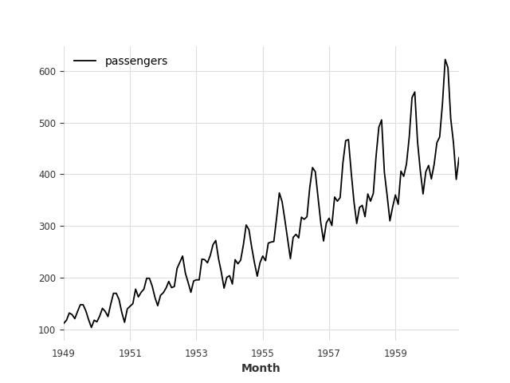
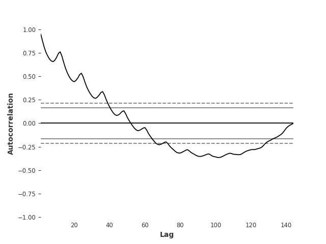
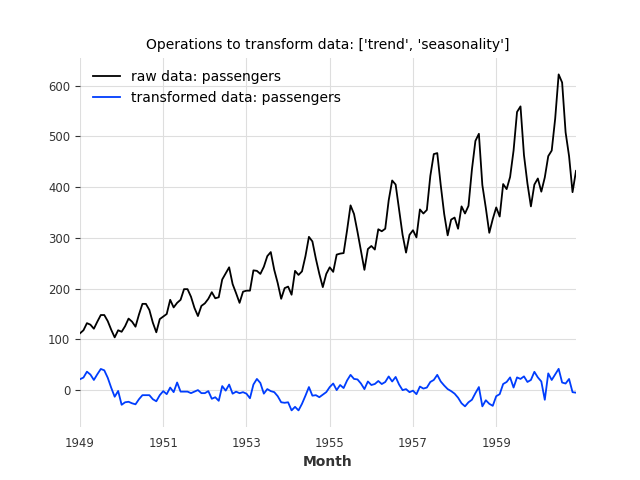
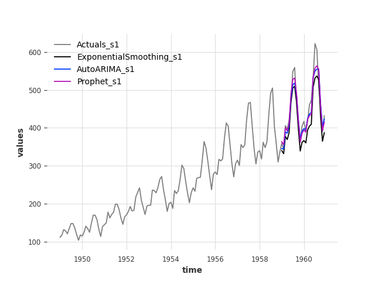
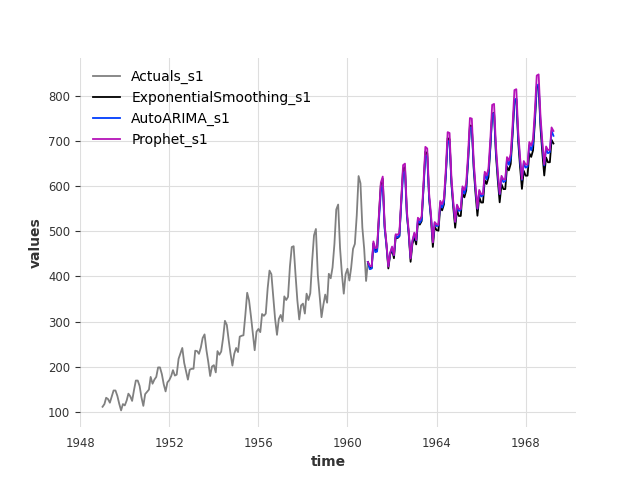
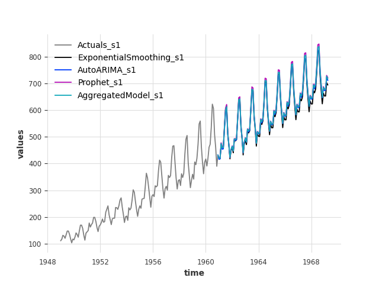

# Python AnalySis for Time Series

[](https://docs.pytest.org)

This package aims to structure the way time series analysis and forecasting is done. 

#### Purpose of the Package 
+ The purpose of the package is to
provide a collection of forecasting models 
and analysis methods for time series in one unified library.

#### Features 
+ Collection of analysis methods:
  - Scipy and statsmodel for testing 
  - Time series processing
  - Statistical testing (stationarity, check seasonality, ...  )
  - Visualization
+ Collection of forecasting models using Darts, which is itself an aggregator of 
   - scikit-learn
   - tenserflow
   - prophet
   - Auto regression models (ARIMA, SARIMA, ....)
   - etc.

#### Installation 
The package can be installed by :
```bash
python3 -m pip install git+https://github.com/eurobios-mews-labs/pasts

```


#### Building the documentation

First, make sure you have sphinx and the Readthedocs theme installed.

If you use pip, open a terminal and enter the following commands:
```shell script
pip install sphinx
pip install sphinx_rtd_theme
```

If you use conda, open an Anaconda Powershell Prompt and enter the following commands:
```shell script
conda install sphinx
conda install sphinx_rtd_theme
```

Then, in the same terminal or anaconda prompt, build the doc with:
```shell script
cd doc
make html
```

The documentation can then be accessed from `doc/_build/html/index.html`.


## Usage and example
You can find examples for the `Signal` class for univariate and multivariate series here: `examples/ex_model.py`

The `Operation` class can be used on its own. Find an example here: `examples/ex_operations.py`

### Start project
To start using the package, import you data as a pandas dataframe with a temporal index and use the `Signal` class.
```python
import pandas as pd

from darts.datasets import AirPassengersDataset
from darts.models import AutoARIMA, Prophet, ExponentialSmoothing, XGBModel, VARIMA
from darts.utils.utils import ModelMode, SeasonalityMode

from pasts.signal import Signal
from pasts.visualization import Visualization

series = AirPassengersDataset().load()
dt = pd.DataFrame(series.values())
dt.rename(columns={0: 'passengers'}, inplace=True)
dt.index = series.time_index
signal = Signal(dt)
```
### Visualize and analyze data
The `properties` attribute contains some information about the data.
Use the `Visualization` class to generate various types of plots.
```python
print(signal.properties)
```
Output:
```python
>>> {'shape': (144, 1), 'types': passengers    float64
dtype: object, 
'is_univariate': True, 
'nanSum': passengers   0
dtype: int64, 
'quantiles':   0.00   0.05   0.50    0.95    0.99   1.00
passengers     104.0  121.6  265.5  488.15  585.79  622.0}
```
```python
Visualization(signal).plot_signal()
Visualization(signal).acf_plot()
```
Yield:




You can also perform some statistical tests specific to time series.
```python
signal.apply_stat_test('stationary')
signal.apply_stat_test('stationary', 'kpss')
signal.apply_stat_test('seasonality')
print(signal.tests_stat)
```
Output: Whether the null hypothesis is rejected and p-value for stationarity, seasonality period for seasonality.
```python
>>> {'stationary: adfuller': (False, 0.9918802434376409),
'stationary: kpss': (False, 0.01),
'seasonality: check_seasonality': (<function check_seasonality at 0x000001D1D62EE310>, (True, 12))}
```

### Machine Learning
Choose a date to split the series between train and test.
```python
timestamp = '1958-12-01'
signal.validation_split(timestamp=timestamp)
```
The library provides some operations to apply before using forecasting models.
In this example, both linear trend and seasonality are removed. Machine Learning models will be trained on the remainig series, then inverse functions will be applied to the predicted series.
```python
signal.apply_operations(['trend', 'seasonality'])
Visualization(signal).plot_signal()
```


Use the method `apply_model` to apply models of your choice. If the parameters `gridsearch` and `parameters` are passed, a gridsearch will be performed.
```python
signal.apply_model(ExponentialSmoothing())

signal.apply_model(AutoARIMA())
signal.apply_model(Prophet())

# Be careful : if trend and seasonality were removed, this specific gridsearch cannot be performed.
param_grid = {'trend': [ModelMode.ADDITIVE, ModelMode.MULTIPLICATIVE, ModelMode.NONE],
              'seasonal': [SeasonalityMode.ADDITIVE, SeasonalityMode.MULTIPLICATIVE, SeasonalityMode.NONE],
              }
signal.apply_model(ExponentialSmoothing(), gridsearch=True, parameters=param_grid)
```
You can pass a list of metrics to the method `compute_scores`. By default, it tries to compute R², MSE, RMSE, MAPE, SMAPE and MAE. Warnings are raised if some metrics are impossible to compute with this type of data.
You can choose to compute scores time-wise or unit-wise with parameter `axis`. However, with univariate data it is preferable to keep the default value (axis=1, unit-wise).
```python
signal.compute_scores(list_metrics=['rmse', 'r2'])
signal.compute_scores()
print(signal.models['Prophet']['scores'])
```
Output:
```python
>>> {'unit_wise':      
                      r2        mse       rmse      mape     smape        mae
component                                                                
passengers        0.866962  590.08557  24.291677  3.694311  3.743241  18.008002, 
'time_wise': {}}
```
```python
print(signal.performance_models['unit_wise']['rmse'])
```
Output:
```python
>>>               Prophet ExponentialSmoothing  AutoARIMA
component                                            
passengers     24.291677            40.306771   26.718103

```
Visualize predictions with the `Visualization` class:
```python
Visualization(signal).show_predictions()
```


When models have been trained, you can compute predictions for future dates using the `forecast`method by passing it the name of a trained model and the horizon of prediction.
```python
signal.forecast("Prophet", 100)
signal.forecast("AutoARIMA", 100)
signal.forecast("ExponentialSmoothing", 100)
Visualization(signal).show_forecast()
```


#### Aggregation of models
The method `apply_aggregated_model` aggregates the passed list of trained estimators according to their RMSE on train data. All passed models will be kept, so make sure to exclude models that are always less performant. The more a model performs compared to others, the greater its weight in agregation.

```python
signal.apply_aggregated_model([AutoARIMA(), Prophet()])
signal.compute_scores(axis=1)
Visualization(signal).show_predictions()
signal.forecast("AggregatedModel", 100)
```


### Author

